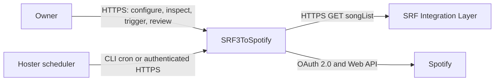
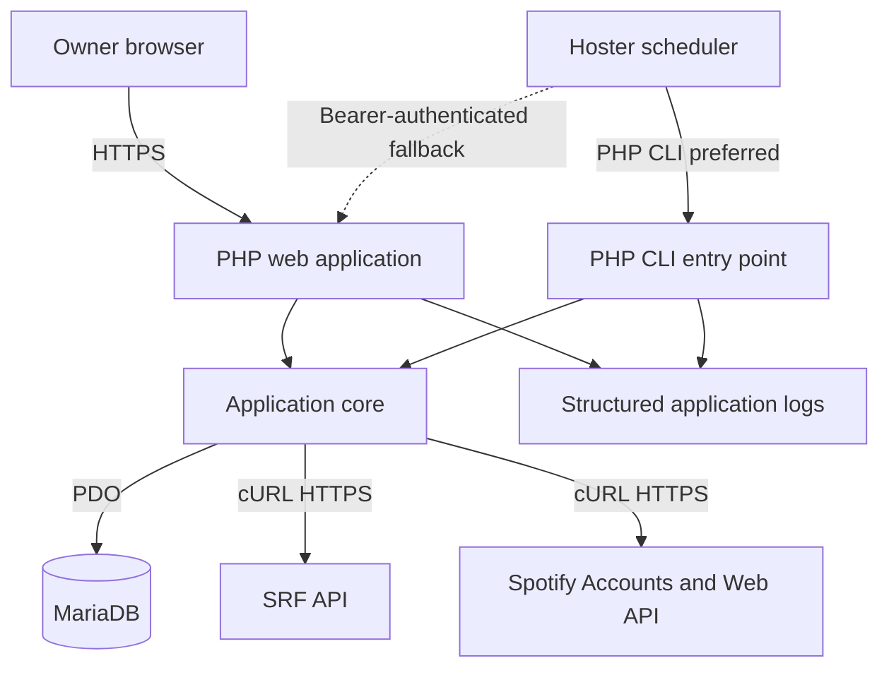
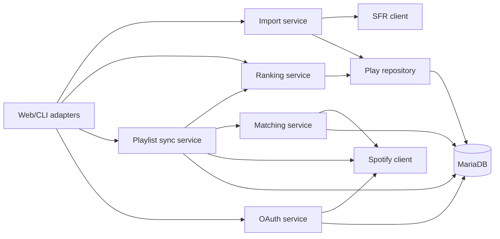

# C4 Views

## Level 1: System Context

```mermaid
flowchart LR
    Owner[Owner] -->|HTTPS: configure, inspect, trigger, review| App[SRF3ToSpotify]
    Scheduler[Hoster scheduler] -->|CLI cron or authenticated HTTPS| App
    App -->|HTTPS GET songList| SRF[SRF Integration Layer]
    App -->|OAuth 2.0 and Web API| Spotify[Spotify]
```

## Level 2: Containers

```mermaid
flowchart TB
    Owner[Owner browser] -->|HTTPS| Web[PHP web application]
    Scheduler[Hoster scheduler] -->|PHP CLI preferred| CLI[PHP CLI entry point]
    Scheduler -.->|Bearer-authenticated fallback| Web
    Web --> Core[Application core]
    CLI --> Core
    Core -->|PDO| DB[(MariaDB)]
    Core -->|cURL HTTPS| SRF[SRF API]
    Core -->|cURL HTTPS| Spotify[Spotify Accounts and Web API]
    Web --> Logs[Structured application logs]
    CLI --> Logs
```

## Level 3: Components

```mermaid
flowchart LR
    Entry[Web/CLI adapters] --> Import[Import service]
    Entry --> Ranking[Ranking service]
    Entry --> Sync[Playlist sync service]
    Entry --> OAuth[OAuth service]
    Import --> Srf[SFR client]
    Import --> Plays[Play repository]
    Ranking --> Plays
    Sync --> Ranking
    Sync --> Match[Matching service]
    Match --> Spotify[Spotify client]
    Sync --> Spotify
    OAuth --> Spotify
    Plays --> DB[(MariaDB)]
    Match --> DB
    Sync --> DB
    OAuth --> DB
```

The label `SFR client` denotes the internal SRF adapter only; the code-facing name remains `SrfClient`.