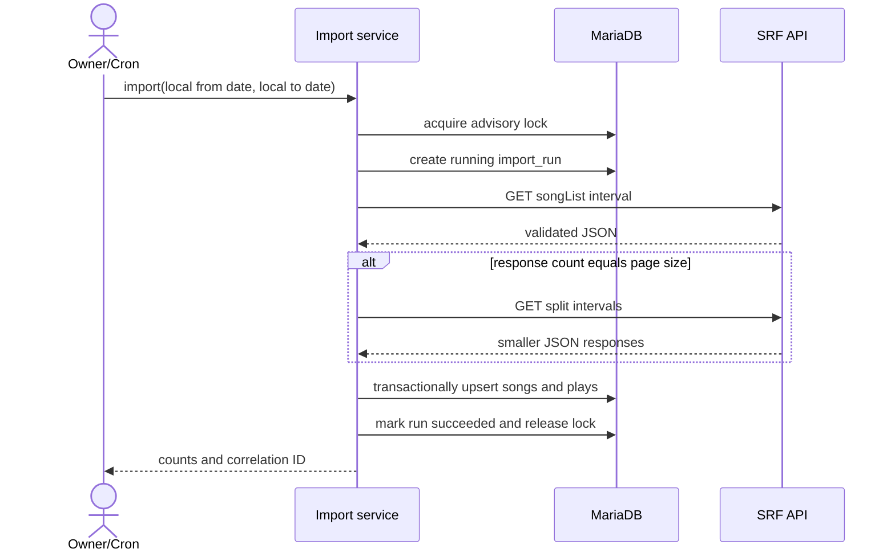
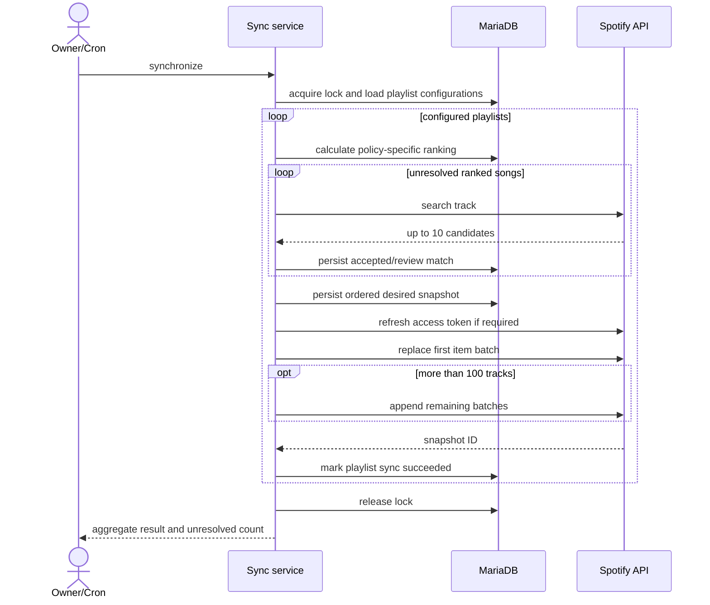

# Business Logic and Workflows

## Import Rules

1. Accept complete local calendar dates in `Europe/Zurich`; reject future end dates and ranges longer than 31 days per request.
2. Convert each local day to an SRF query from local `00:00:00` through `23:59:59`, preserving the applicable UTC offset.
3. Request `pageSize=500`; validate HTTP status, content type, root `songList`, and every required field.
4. If a response contains exactly 500 events, treat it as potentially truncated and recursively split the interval until each response is below 500 or one-hour resolution is reached.
5. Normalize display whitespace and build song/event hashes; do not remove Swiss country markers from stored identity.
6. Insert the complete response in one transaction using unique-key conflict handling.
7. Mark the run successful only after commit; retries reuse the same rules and create no duplicate plays.

## Ranking Rules

- Window: last `ranking_days` complete Europe/Zurich calendar days; default under A-003 is 30.
- Optional playlist policy: include weekdays only and constrain local play start time to an inclusive/exclusive minute range.
- `SRF 3 - Der Morgen`: Monday through Friday, local minute `360` (06:00) inclusive through `600` (10:00) exclusive.
- Reconstruct each play's Swiss local weekday and time from UTC timestamp plus stored source offset, including daylight-saving changes.
- Group by logical `song.id`, not raw title spelling from individual plays.
- Sort by play count descending, latest play descending, normalized artist ascending, normalized title ascending.
- Return at most `max_tracks`; default under A-003 is 50.
- Songs without an accepted Spotify match remain visible but are omitted from playlist output and counted as unresolved.

## Matching Rules

- Search Spotify with track and artist filters, market `CH`, type `track`, and current API maximum `limit=10`.
- Remove known radio-only suffixes such as `(CH)` from the search query, while retaining original values in storage.
- Score normalized title equality, primary artist equality, duration proximity and penalties for `live`, `karaoke`, `tribute` or cover indicators absent from the SRF title.
- Automatically accept only scores at or above 0.90 with a margin of at least 0.10 over the second result.
- Scores below the threshold enter `review`; no-match outcomes enter `review`, not permanent failure.
- A manual track ID or explicit rejection always overrides future automatic searches until the owner resets it.

## Playlist Synchronization

- Acquire a MariaDB advisory lock before calculating the desired playlist.
- Load every configured playlist and calculate its ranking policy independently within the same locked synchronization.
- Persist the ordered desired snapshot before calling Spotify.
- Create each configured playlist once through `POST /v1/me/playlists` when no playlist ID exists.
- Replace items through the current `/v1/playlists/{playlist_id}/items` contract. Replace the first batch and append subsequent batches of at most 100.
- Never modify a playlist not owned by the authorized Spotify account.
- On failure, retain the desired snapshot and previous successful run metadata for retry and diagnosis.
- Attempt every configured playlist even if another target fails; report the overall call as failed after all attempts.
- Repeating synchronization with the same ranking yields the same URI sequence.

## Import Sequence

## Spotify Synchronization Sequence

## Failure and Retry Rules

- HTTP timeouts: connect 5 seconds, total 20 seconds, at most three attempts for idempotent GET/token requests.
- Spotify `429`: honor `Retry-After`; scheduled run may stop cleanly and retry later rather than sleeping beyond hosting limits.
- Other `4xx`: fail without blind retry and expose sanitized response details.
- `5xx` and network failures: exponential retries with jitter inside the 30-second import budget.
- A crashed run is considered stale after 15 minutes; a later run may mark it failed after acquiring the advisory lock.

## Retention

- `cleanup` removes completed import and synchronization runs older than the configured retention period; default 90 days.
- Imported plays remain stored when their originating run metadata expires.
- Structured log records older than the cutoff are pruned line by line; malformed lines remain for diagnosis.
- Running or unfinished runs are never removed by retention.