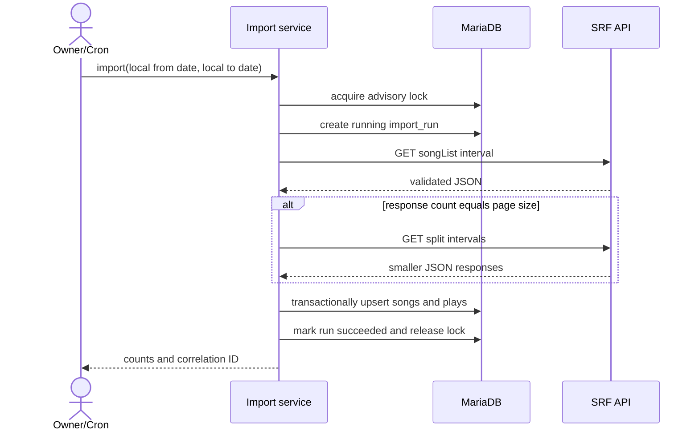

# Business Logic and Workflows

## Import Rules

1. Accept complete local calendar dates in `Europe/Zurich`; reject future end dates and ranges longer than 31 days per request.
2. Convert each local day to an SRF query from local `00:00:00` through `23:59:59`, preserving the applicable UTC offset.
3. Request `pageSize=500`; validate HTTP status, content type, root `songList`, and every required field.
4. If a response contains exactly 500 events, treat it as potentially truncated and recursively split the interval until each response is below 500 or one-hour resolution is reached.
5. Normalize display whitespace and build song/event hashes; do not remove Swiss country markers from stored identity.
6. Insert the complete response in one transaction using unique-key conflict handling.
7. Mark the run successful only after commit; retries reuse the same rules and create no duplicate plays.

## Ranking Rules

- Window: last `ranking_days` complete Europe/Zurich calendar days; default under A-003 is 30.
- Optional fixed window: use persisted inclusive `fixed_from_utc` and exclusive `fixed_to_utc` boundaries instead of a rolling window.
- Optional playlist policy: include weekdays only and constrain local play start time to an inclusive/exclusive minute range.
- `SRF 3 - Der Morgen`: Monday through Friday, local minute `360` (06:00) inclusive through `600` (10:00) exclusive.
- `SRF 3 - Schweizer Musiktag 2026`: `2026-09-17 03:00:00Z` inclusive through `2026-09-17 22:00:00Z` exclusive, equivalent to 05:00 through 24:00 Europe/Zurich.
- Reconstruct each play's Swiss local weekday and time from UTC timestamp plus stored source offset, including daylight-saving changes.
- Group by logical `song.id`, not raw title spelling from individual plays.
- Sort by play count descending, latest play descending, normalized artist ascending, normalized title ascending.
- Traverse the complete policy-specific ranking until `target_tracks` unique accepted Spotify tracks have been selected or the candidate pool is exhausted; never exceed `max_tracks`.
- Exclude active global rules and rules for the current playlist before accepting a candidate. Airplay history and general statistics remain unchanged.
- Excluding one logical song also excludes aliases mapped to its current accepted Spotify track ID. Distinct Spotify track IDs for live, remix or edit variants remain eligible.
- Songs without an accepted Spotify match and duplicate Spotify track IDs are skipped; lower-ranked unique accepted tracks fill the remaining target positions.
- The playlist page displays the final contiguous target positions and a secondary list of examined missing-match or duplicate candidates with original airplay rank and reason. Active exclusions are not displayed there.

## Ignored Song Rules

- An owner may create a playlist-specific rule or a global rule. Global rules apply to existing and future playlists.
- Reasons are optional, trimmed, and limited to 500 characters. Scope and reason are immutable after creation.
- Global and playlist-specific periods remain independent. Reactivating a global period does not close active playlist-specific periods.
- A global period may be added while playlist-specific periods exist. A new playlist-specific period is rejected while a global period is active.
- Only one active period per song and scope is allowed. Reactivation closes the period; ignoring the song later creates a new period.
- New or reactivated rules affect the web preview immediately and Spotify only from the next synchronization started after the change.

## Matching Rules

- Search Spotify with optional track and artist filters, market `CH`, type `track`, and pages of 10 results.
- Remove known radio-only suffixes such as `(CH)` from the search query, while retaining original values in storage.
- Score normalized title equality, primary artist equality, duration proximity and penalties for `live`, `karaoke`, `tribute` or cover indicators absent from the SRF title.
- Automatically accept only scores at or above 0.90 with a margin of at least 0.10 over the second result.
- Scores below the threshold enter `review`; no-match outcomes enter `review`, not permanent failure.
- The owner may search from the dashboard or playlist detail, edit artist/title independently, inspect Spotify metadata and select one result explicitly. Direct URL/track-ID assignment remains a fallback.
- A manual track selection is global for the logical song and overrides future automatic searches.
- Resetting a mapping stores a trackless manual `review` state, preventing automatic reassignment until the owner chooses a new track.
- Rejecting a match is replaced by a global ignore rule with an optional reason. Existing manual rejections migrate to active global rules and trackless manual `review` matches; reactivation leaves the song open for manual review.

## Playlist Synchronization

- Acquire a MariaDB advisory lock before calculating the desired playlist.
- Load every configured playlist and snapshot all effective exclusions once within the advisory lock. Rule changes made while the run is active apply to the next run.
- Calculate each playlist target independently from its complete airplay ranking, accepted matches and exclusion snapshot.
- Persist the ordered desired snapshot before calling Spotify.
- Create each configured playlist once through `POST /v1/me/playlists` when no playlist ID exists.
- Convert each configured PNG cover to JPEG and upload it through `PUT /v1/playlists/{playlist_id}/images` on every synchronization.
- Replace items through the current `/v1/playlists/{playlist_id}/items` contract. Replace the first batch and append subsequent batches of at most 100.
- Never modify a playlist not owned by the authorized Spotify account.
- On failure, retain the desired snapshot and previous successful run metadata for retry and diagnosis.
- Attempt every configured playlist even if another target fails; report the overall call as failed after all attempts.
- Repeating synchronization with the same ranking yields the same URI sequence.
- Fixed-size targets with too few eligible tracks are still published successfully. The run records a warning with requested/actual counts and aggregate ignored, missing-match and duplicate causes.

## Import Sequence



## Spotify Synchronization Sequence

```mermaid
sequenceDiagram
    actor Trigger as Owner/Cron
    participant App as Sync service
    participant DB as MariaDB
    participant Spotify as Spotify API
    Trigger->>App: synchronize
    App->>DB: acquire lock, load configurations and snapshot exclusions
    loop configured playlists
        App->>DB: calculate complete policy-specific ranking
        loop candidates until target is full
            App->>Spotify: search track
            Spotify-->>App: up to 10 candidates
            App->>DB: persist accepted/review match
        end
        App->>App: exclude rules and duplicate tracks; backfill from lower ranks
        App->>DB: persist ordered desired snapshot
        App->>Spotify: refresh access token if required
        App->>Spotify: upload JPEG playlist cover
        App->>Spotify: replace first item batch
        opt more than 100 tracks
            App->>Spotify: append remaining batches
        end
        Spotify-->>App: snapshot ID
        App->>DB: mark sync succeeded with target diagnostics
    end
    App->>DB: release lock
    App-->>Trigger: aggregate result, warning flag and cause counts
```

## Failure and Retry Rules

- HTTP timeouts: connect 5 seconds, total 20 seconds, at most three attempts for idempotent GET/token requests.
- Spotify `429`: honor `Retry-After`; scheduled run may stop cleanly and retry later rather than sleeping beyond hosting limits.
- Other `4xx`: fail without blind retry and expose sanitized response details.
- `5xx` and network failures: exponential retries with jitter inside the 30-second import budget.
- A crashed run is considered stale after 15 minutes; a later run may mark it failed after acquiring the advisory lock.

## Retention

- `cleanup` removes completed import and synchronization runs older than the configured retention period; default 90 days.
- Imported plays remain stored when their originating run metadata expires.
- Structured log records older than the cutoff are pruned line by line; malformed lines remain for diagnosis.
- Running or unfinished runs are never removed by retention.